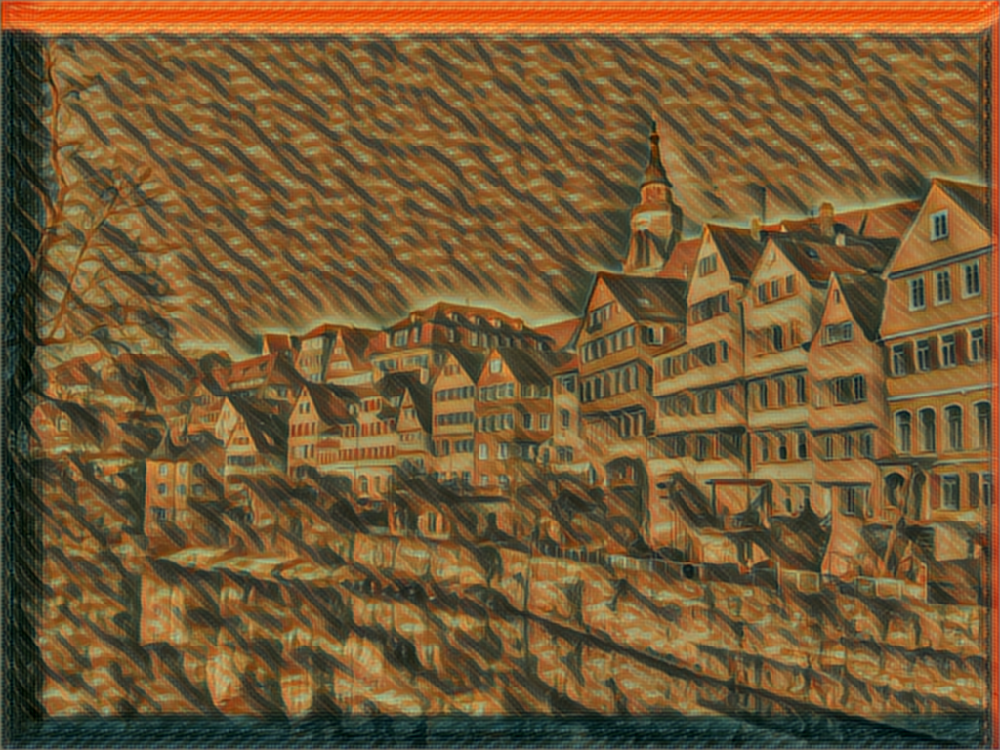
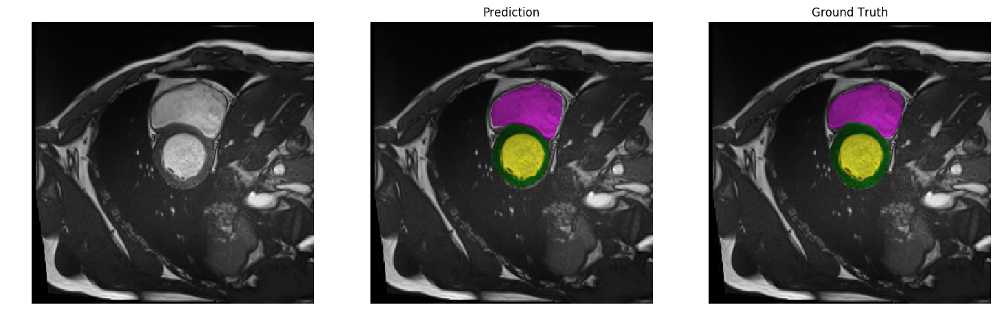

# nnvm-vision-demo
The scripts in this repository can be used to generate following images. Note that these scripts can run on both NVIDIA and AMD GPUs. This is made possible by NNVM and TVM.

I thank original authors of the code and models used in this demo.

## DCGAN

Loads and runs MXNet-Gluon model, trained with [this](http://gluon.mxnet.io/chapter14_generative-adversarial-networks/dcgan.html) notebook.

The script ```dcgan.py``` generates the following plausible faces.

<div align='center'>
  
</div>

## Image Superresolution

Loads and runs the state of the art image superresolution netowork in ONNX format.
The pretrained Pytorch model available in this [repository](https://github.com/twtygqyy/pytorch-SRResNet) is exported to ONNX, and used in this demo. This is the same model used in [this](http://www.tvmlang.org/2017/10/30/Bringing-AMDGPUs-to-TVM-Stack-and-NNVM-Compiler-with-ROCm.html) blog post.

Given the 64x64 image on the left, the script ```srresnet.py``` generates the 256x256 image on the right.
On the middle is a 256x256 image obtained by resizing with bicubic interpolation.

<div align='center'>
  
</div>

## Fast Style Transfer
Loads and runs Feedforward Neural Style Transfer network, introduced by [Johnson et al](https://github.com/jcjohnson/fast-neural-style).

I trained the MXNet model using the code in [this](https://github.com/zhaw/neural_style) repository.  I don't know why the generated image has annoying artifact on the image border. Anyway, training a good model is not my point here, so I just leave it at that.

<div align='center'>


<br></br>

</div>

## Cardiac MR Image Segmentation
Loads and runs a image segmentation network. The input is a cardiac MR image that depicts the left venticle (yellow), the myocardium (green), and the right venticle (pink). The network tries to segment these three.

The network architecture is called UNet, because it has U-shaped connections between layers. The details are in [the original paper](https://arxiv.org/abs/1505.04597).

I trained the model with Pytorch and exported it in ONNX format. Below I put one of the good prediction results, but the accuracy of the trained model is not good at the moment. I'm working on training a better model. But again, training a good model is not my point in this demo.

The data comes from [ACDC Challenge](https://www.creatis.insa-lyon.fr/Challenge/acdc/index.html) held at MICCAI 2017.

<div align='center'>
  
</div>
